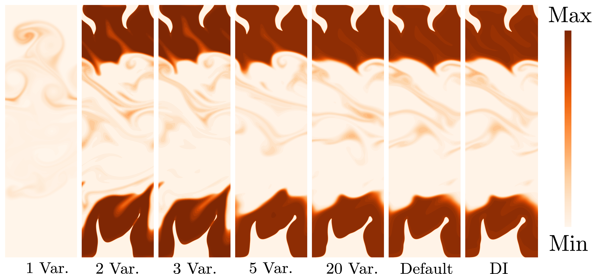
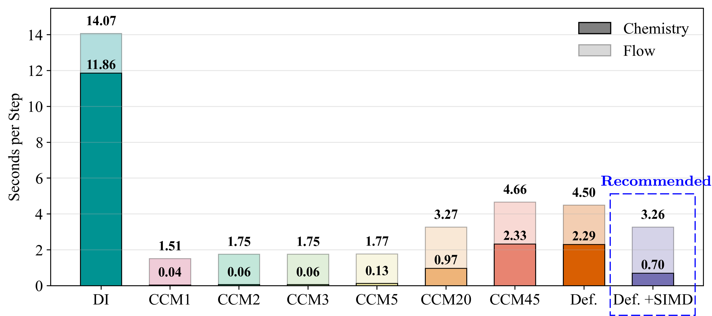
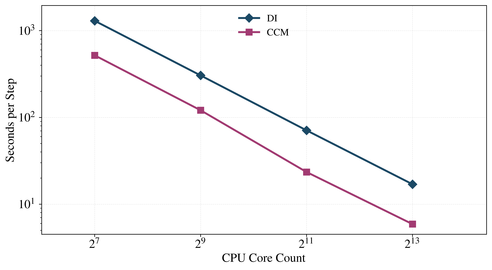
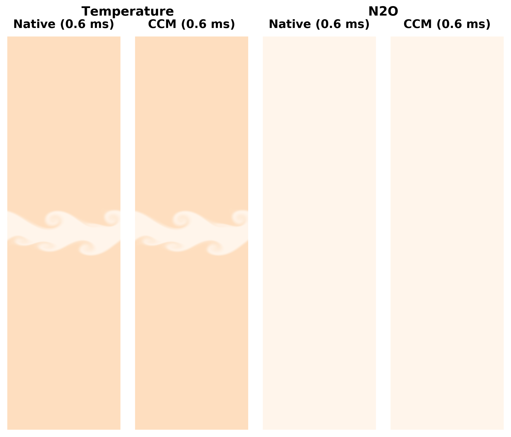

<h1 align="center">Chemistry Coordinate Mapping (CCM)</h1>
<p align="center"><em>Bai's group, The Department of Energy Sciences, Lund University</em></p>
<p align="center"><strong>✈️ Chemistry shouldn't be the bottleneck anymore.</strong></p>

## Overview

**CCM (Chemistry Coordinate Mapping)** is an accurate and efficient chemistry acceleration method for several OpenFOAM Foundation versions. By grouping CFD cells with similar thermochemical states and sharing their reaction-rate calculations, CCM delivers substantial speedups while preserving accuracy. The latest implementation works directly on general reactive cases, keeping direct integration (DI) accuracy at roughly the cost of a cold-flow simulation.

The reaction rates (RR) depend on the mixture composition (mass fractions $Y_i$ of the $i$-th species), temperature (T), and pressure (p). Simulation results improve, approaching the DI accuracy, as more of these variables are accounted for in CCM.

<p align="center">
  
</p>
<p align="center"><em><strong>Figure 1.</strong> Nitric oxide (NO) distributions grow progressively closer to DI as more variables are included in CCM. Tested on LUMI with a 2D DNS case featuring dual-fuel combustion.</em></p>

A key strength of CCM is that it stays efficient even after all dependent variables are included, thanks to several rounds of optimization. Combined with a [SIMD-optimized stiff solver](https://github.com/chizixin-688/FastChemistrySolver-OpenFOAM-10), chemistry is no longer the bottleneck: the chemistry step costs less than the flow-transport step.

<p align="center">
  
</p>
<p align="center"><em><strong>Figure 2.</strong> Wall-clock time breakdown: with all dependent variables active, the chemistry step costs less than the flow-transport step. Tested on LUMI with a 2D DNS case featuring dual-fuel combustion.</em></p>

Additionally, it scales well to thousands of cores.

<p align="center">
  
</p>
<p align="center"><em><strong>Figure 3.</strong> Parallel scaling of CCM up to thousands of cores, tested on Sandia Flame D.</em></p>

### 📦 Supported Versions

| OpenFOAM Version | Status | Notes |
| --- | --- | --- |
| **OpenFOAM-14** | ✅ Latest | Full feature set: SIMD-optimized ODE solver, MPHashTable, native MPI, and cellZone restriction |
| **OpenFOAM-10** | ✅ Supported | Same feature set except for cellZone restriction |
| **OpenFOAM-13** | 🗄️ Legacy | Reference only, in `OpenFOAM-13-legacy/`, no optimized ODE/nativeMPI/MPHashTable |

The examples in this README target **OpenFOAM-14**. If you are running an earlier version, the configuration keywords are the same, but the solver name and a few dictionary details differ; refer to the ready-to-run tutorial in that version's directory (e.g. `OpenFOAM-10/Sandia/`).

## ✨ Key Features

✅ **Adaptive Error Control (EC)**: Automatically keeps chemistry errors below a user-defined threshold (1/nSlice), accounting for important species. It runs with minimal overhead, dynamically adjusting the grouping strategy to keep errors within user-specified bounds. Theory and implementation details are in the author's [PhD Thesis](https://portal.research.lu.se/files/226878780/thesis_yuchen_no_signature.pdf); this version is the closest in spirit to the [original paper](https://www.tandfonline.com/doi/epdf/10.1080/13647830.2012.713518?needAccess=true).  
✅ **Strong Performance**: For most mechanisms (stiffness at or below GRI-Mech 3.0), chemistry takes less time than the flow solver.  
✅ **Zero Configuration**: Sensible defaults out of the box: EC over all species + T/p, balancing accuracy and speed automatically.  
✅ **SIMD-optimized ODE solver**: Integrates several [extremely efficient stiff solvers](https://github.com/chizixin-688/FastChemistrySolver-OpenFOAM-10) contributed by the community.  
✅ **Load-balanced parallelism**: A dedicated load-balancing algorithm distributes the computational load while reducing communication overhead in parallel runs.  
✅ **MPHashTable**: A memory-pool-backed hashtable that speeds up state storage and lookup.  
✅ **Native MPI**: Inter-core communication uses native MPI calls directly, further cutting method overhead (supports OpenFOAM-10/14).  
✅ **cellZone restriction**: Reaction rates can be integrated only inside a cell zone, which may be regenerated every chemistry step to track the flame. See [docs/cellZone.md](docs/cellZone.md).  


## 🔧 Compilation

### Prerequisites

- An installed OpenFOAM Foundation version (14 recommended; 10 also supported)

### Build Instructions

We use OpenFOAM-14 as an example below; other versions are identical apart from the path.

1. **Set up your OpenFOAM environment**:
   ```bash
   source /path/to/OpenFOAM-14/etc/bashrc  # Update with your installation path
   ```

2. **Compile the CCM library**:
   ```bash
   cd OpenFOAM-14/code/
   wclean && wmake -j
   ```


## 🚀 Usage

### Quick Start Guide (OpenFOAM-14)

1. **Load the CCM library** in `<case>/system/controlDict`:
   ```cpp
   libs ("libCCM.so");
   ```

2. **Select CCM** in `<case>/constant/chemistryProperties`:
   ```cpp
   type            CCM;
   chemistry       on;

   ode
   {
       solver          seulex;
       absTol          1e-08;
       relTol          0.1;
   }

   CCM
   {
       nSlice          50;
       ignoreMin       1e-6;
       optimizedODE    true;
   }
   ```
   This minimal `CCM` dictionary is enough for most cases: Error Control runs automatically over **all species** and **T** (and **p** when needed). For manual variable selection, adaptive EC, distributed communication, and other options see [configuration](docs/configuration.md).

   The above basic setting should work for most cases. The author recommends to check [configuration](docs/configuration.md) only when a big case utilizing thousands of cores is attempted.

3. **Run the simulation** with `foamRun` (set `solver multicomponentFluid;` in `controlDict`):
   ```bash
   # Serial
   foamRun

   # Parallel (6 cores)
   decomposePar -force -fileHandler collated
   mpirun -n 6 foamRun -parallel -fileHandler collated
   ```

> **Earlier versions**: OpenFOAM-10 uses `chemistryType { solver ode; method CCM; }` instead of `type CCM;`, and the solver is `reactingFoam` rather than `foamRun`. The `CCM` dictionary is unchanged. If you attempt an earlier version, copy the settings from the ready-to-run tutorial in that version's directory (e.g. `OpenFOAM-10/Sandia/`).

### 📊 Test Cases

Two ready-to-run cases are included for validation and performance testing:

- **Sandia Flame D**: a piloted methane/air jet flame RANS case adapted from the OpenFOAM tutorials, ideal for a quick accuracy check.
- [**RCCI**](OpenFOAM-10/rcci) (only in OpenFOAM-10): a DNS case from [our paper](https://www.sciencedirect.com/science/article/pii/S1540748924004097), simplified by removing the diesel jet and coarsening the mesh. It runs in ~2 h on 6 cores (vs. ~12h for DI).


## ⚙️ Advanced Configuration

The minimal setup above is enough for most cases. For finer control:

- **[docs/configuration.md](docs/configuration.md)**: the `mode`, `nSlice`, and `principalVars` parameters, adaptive error control (`ecMode`), and distributed-mode communication (`communicator`).
- **[docs/cellZone.md](docs/cellZone.md)**: restricting chemistry integration to a dynamically regenerated cell zone (OpenFOAM-14).

## 🏆 Real-World Performance

### RCCI-concept DNS Simulation Results

A challenging RCCI (Reactivity Controlled Compression Ignition) case, run with:
- **all principal variables** (far more than needed; a stress test for the code)
- **nSlice = 50**



**Results**:
- ✅ **Visually identical** to DI
- ✅ **4× faster** than traditional methods (better than our published 2× improvement)
- ✅ **No observable difference** in any of the examined metrics


## 📜 License

GPL-3.0 License (same as OpenFOAM)

Copyright (C) 2021 Shijie Xu, Shenghui Zhong  
Copyright (C) 2025 Yuchen Zhou  
Based on OpenFOAM® (Copyright (C) 2016-2025 OpenFOAM Foundation)

See [COPYING](COPYING) file for full license text.


## 📚 Citation

If you use CCM in your research, please cite:

```bibtex
@article{jangi2012multidimensional,
  title={Multidimensional chemistry coordinate mapping approach for combustion modelling with finite-rate chemistry},
  author={Jangi, Mehdi and Bai, Xue-Song},
  journal={Combustion Theory and Modelling},
  volume={16},
  number={6},
  pages={1109--1132},
  year={2012},
  publisher={Taylor \& Francis}
}

@article{zhou2025detailed,
  title={Detailed numerical simulation of ammonia/diesel combustion under CI engine conditions},
  author={Zhou, Yuchen},
  year={2025}
}

@article{jangi2013development,
  title={Development of chemistry coordinate mapping approach for turbulent partially premixed combustion},
  author={Jangi, Mehdi and Yu, Rixin and Bai, Xue-Song},
  journal={Flow, turbulence and combustion},
  volume={90},
  number={2},
  pages={285--299},
  year={2013},
  publisher={Springer}
}


@inproceedings{vauquelin2025multidimensional,
  title={Multidimensional chemistry coordinate mapping for large eddy simulations of a turbulent premixed bluff-body burner},
  author={Vauquelin, Pierre and Zhou, Yuchen and {\AA}kerblom, Arvid and Fureby, Christer and Bai, Xue-Song},
  booktitle={AIAA SCITECH 2025 Forum},
  pages={2485},
  year={2025}
}


```

## 👤 Author
Current version author: Yuchen Zhou

Second version author: Shijie Xu, Shenghui Zhong

First version author: Mehdi Jangi


